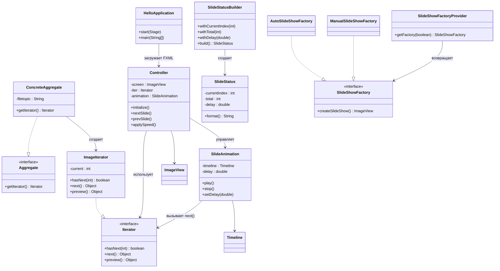

# Slider
----------------

## Описание
Slider — JavaFX-приложение для создания и воспроизведения интерактивных слайд-шоу с текстовыми пометками, тегами и графическими оверлеями. Пользователь загружает изображения, добавляет эмоции и заметки, настраивает анимацию. Проект демонстрирует работу с JavaFX UI, медиаплеером, файловой системой и сериализацией.

---

## Технологический стек
- Java 21  
- JavaFX 21 (controls, FXML, media, swing)  
- Maven (сборка и запуск)  
- Jackson Databind для JSON  
- Desktop standalone приложение

---

## Статус
Beta

---

## Ссылка на репозиторий и демо
[GitHub репозиторий](https://github.com/MaksHramov/javaFX-2/);

---

## Основные возможности
- Добавление фото и видео-слайдов с выбором типа (Photo/Motion)     
- Настройка анимации (Fade/Slide/Scale) и длительности для каждого слайда   
- Автовоспроизведение с режимами Sequential, Loop и Bounce

---

## Архитектура
- **Пакет `controller`**  
  - `MainController` управляет UI, связывает форму с сервисами, реагирует на действия пользователя и поддерживает предпросмотр.  
- **Пакет `model`**  
  - Доменные сущности (`Slide`, `SlideOverlay`, `SlideNote`, `AnimationSettings`, `EmotionOverlay`) описывают содержимое слайда.  
  - DTO (`SlideDto`, `SlideCollectionDto`, `SlideOverlayDto`, `EmotionOverlayDto`, `SlideNoteDto`, `AnimationSettingsDto`) используются для обмена через JSON.  
  - `SlideDescriptor` собирает данные из формы, `SlideIterator` инкапсулирует навигацию, `PlaybackStatus` и `PlaybackStatusBuilder` формируют статусную строку.  
- **Пакет `service`**  
  - `SlideShowService` управляет ObservableList слайдов и использует `SlideFactoryProvider` + фабрики (`PhotoSlideFactory`, `MotionSlideFactory`) для создания объектов.  
  - `SlideCollectionService` отвечает за экспорт/импорт коллекций, `SlidePlaybackService` за анимацию, `AudioService` за работу с медиаплеером.  
- **Пакет `util`**  
  - Вспомогательные классы (`AppPaths`, `FxDurationUtils`, `NodeSnapshotUtil`) для путей, конвертации длительностей и экспортов изображений.  
- **FXML и ресурсные файлы** описывают интерфейс и биндинги для контроллера, а `MemoryGalleryApplication` является точкой входа.

---

## Диаграмма классов


---

## Установка и запуск
1. Клонировать репозиторий:  
```bash
git clone https://github.com/MaksHramov/javaFX-2.git
```
2. Перейти в директорию проекта:  
```bash
cd javaFX-2
```
3. Собрать проект:  
```bash
mvn clean install
```
4. Запустить JavaFX-приложение:  
```bash
mvn javafx:run
```

---

## Особенности реализации 
- **Анимации**: `SlidePlaybackService` включает Fade/Slide/Scale-транзишены и сбрасывает состояние узла после завершения.  
- **Пути и каталоги**: `AppPaths` централизовано задаёт директории для изображений, коллекций и экспортов.

---

## Зависимости
- JavaFX 21 (controls, fxml, media, swing)  
- Jackson Databind 2.18  
- JUnit 5 (для тестов)  
- Maven Compiler Plugin + JavaFX Maven Plugin

---

## Ограничения и известные проблемы
- Тесты пока отсутствуют и проверка проводится вручную.  
- Поддерживаются только локальные файлы; облачные источники не подключены.  
- Форматы аудио ограничены расширениями, разрешёнными JavaFX Media (mp3/wav/aac).  
- Для корректного автопоказа требуется JavaFX Media с аппаратным ускорением (на headless-средах может не работать).

---

## Контакты и поддержка
Пишите вопросы и предложения в разделе Issues GitHub репозитория.

---

## Скриншоты
Скриншоты интерфейса будут добавлены после подготовки макетов (раздел `docs/screenshots/`). Пока можно использовать инструмент `Сохранить слайд` для генерации собственного примера.

